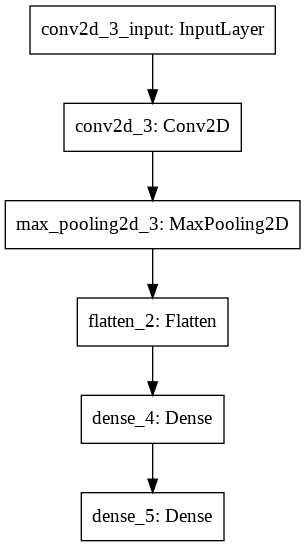
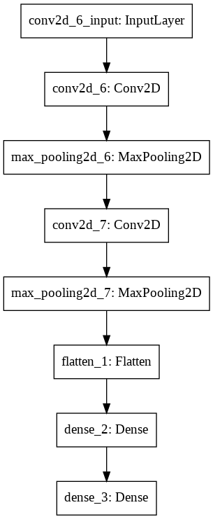
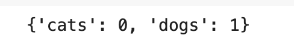

## Image-Classification-using-CNN
##### Building a Dog/Cat classifier using Image Preprocessing and Convolutional Neural Networks
*Image classification* has a few uses and vast potential as it grows in reliability. 
Here are just a few examples of what makes it useful.

+ Self Driving cars use image classification to identify what’s around them i.e. trees, people, traffic-lights, etc.

- Image classification also helps in healthcare. For eg,it could analyse medical images and suggest whether they classify as depicting a symptom of illness.

### Dependencies:
+ [Numpy](https://numpy.org)
+ [Tensorflow](https://www.tensorflow.org)
+ [Keras](https://keras.io)

### Dataset:
We use a [Dataset](https://drive.google.com/drive/u/0/folders/107Xj6pUqVRFFh4lYdDDvzsg7r1Hz2YYR), which contains 10,005 images of 2 classes viz Cat and Dog. The data is split into 8,005 training images and 2,000 testing images. One can send access request in order to use the same dataset. One can also choose any other dataset of their choice.

### Model Components:

 

- Base Model:  The model has 1 conv2D Layer followed by a MaxPooling2D. The Flatten layer follows before the forward pass and classification task performed by the Fully Connected Layers with ReLU and Sigmoid function respectively

- New Model:  The model has 2 conv2D Layers each followed by a MaxPooling2D. The Flatten layer follows before the forward pass and classification task performed by the Fully Connected Layers with ReLU and Sigmoid function respectively

### Guidelines to use the repo:
- Cloning the Repository: 

        git clone https://github.com/Rusali28/Image-Classification-using-CNN
        
- Entering the directory: 

        cd Image-Classification-using-CNN`

- Setting up the Python Environment with dependencies:

        pip install -r requirements.txt
        
- Running the test file:
        
        python3 test.py
        --img='path/to/image.jpeg' 
        --model='path/to/base_model.h5' 

### Results:
Our Model Predictions: 
 

### Contributors 
- [Rusali Saha](https://github.com/Rusali28)
- [Saisha Shetty](https://github.com/SaishaShetty)
- [Srijarko Roy](https://github.com/srijarkoroy)
